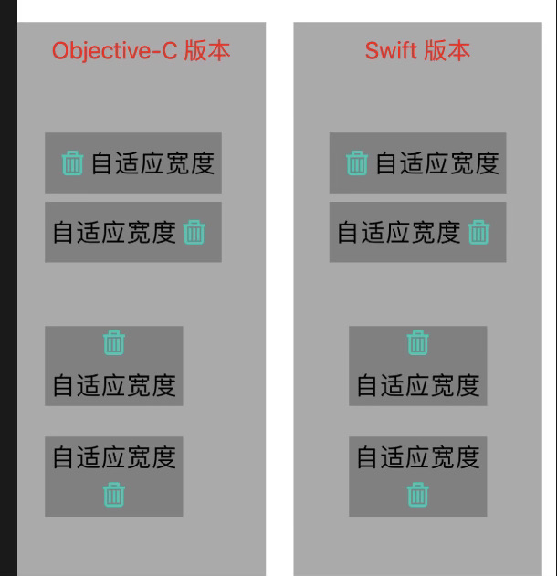

# MOImageButton
利用 Mansory / SnapKit 调整按钮的图片位置，分别显示在上下左右：



# How to use

## 一、OC：

1、add the `MOImageButton.h` and `MOImageButton.m` files into your project

2、then `import "MOImageButton.h"` when need use file

3、code such as：

```objective-c
// set image type
MOImageButton *btn = [MOImageButton buttonWithType:UIButtonTypeCustom imageType:type]; 
btn.backgroundColor = [UIColor grayColor];
[btn setTitle:@"自适应宽度" forState:UIControlStateNormal];
[btn setTitleColor:[UIColor blackColor] forState:UIControlStateNormal];
[btn setImage:[UIImage imageNamed:@"icon_delete"] forState:UIControlStateNormal];
[self addSubview:btn];
[btn mas_makeConstraints:^(MASConstraintMaker *make) {
  make.top.mas_equalTo(220);
  make.left.mas_equalTo(20);
}];
[btn moLayout]; // use after add to superView
```

----

## 二、Swift：

1、add `MOButton.swift` file into your project

2、code such as：

```swift
let btn: MOButton = MOButton(type: .custom)
btn.moType = type // set image type
btn.backgroundColor = .gray
btn.setTitle("自适应宽度", for: .normal)
btn.setTitleColor(.black, for: .normal)
btn.setImage(UIImage(named: "icon_delete"), for: .normal)
self.addSubview(btn)
btn.snp.makeConstraints { (make) in
  make.top.equalTo(220)
  make.centerX.equalToSuperview()
}
btn.moLayout() // use after add to superView
```

